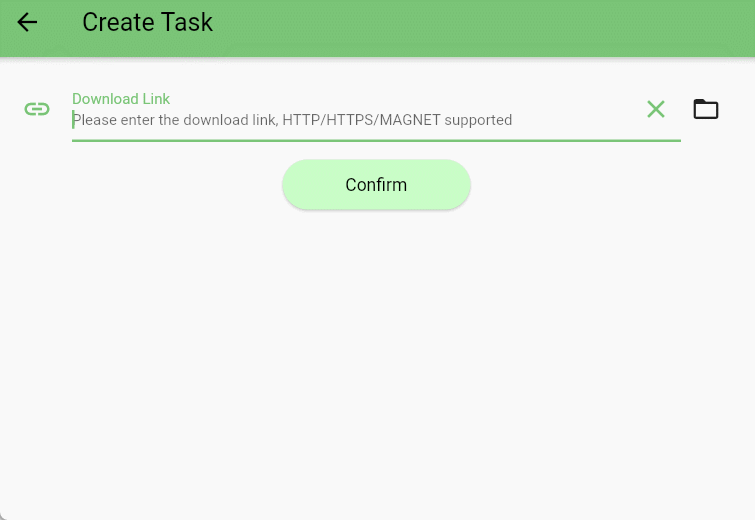

[English](README.md) | [中文](README_zh-CN.md)

## 介绍

此示例演示如何通过`webpack`工程来构建扩展脚本，通过安装第三方依赖`cheerio`来解析`html`内容，最终实现一个可以下载指定 github 仓库所有贡献者头像的扩展。

- 效果图



## 构建

```bash
npm install
npm run build
```
